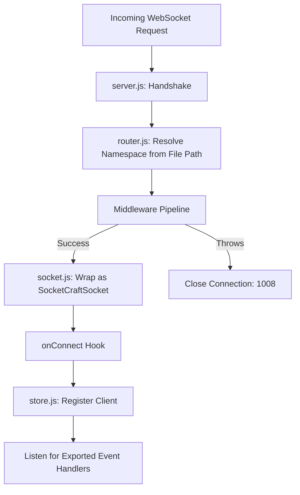

<div align="center">

# 🔌 SocketCraft

### The Zero-Config, File-Based Routing WebSocket Framework for Node.js

[](https://www.npmjs.com/package/socket-craft)
[](#-license)
[](#)
[](#)
[](https://github.com/websockets/ws)

**Next.js-style file routing — reimagined for real-time WebSocket communication.**

[Getting Started](#️-quick-start) • [Documentation](./WIKI.md) • [Features](#-features) • [Architecture](#-project-structure)

</div>

---

## 🧠 Why SocketCraft?

Traditional WebSocket servers force you to manually register namespaces and pattern-match event strings by hand:

```javascript
io.of('/chat').on('connection', (socket) => {
  socket.on('message', (data) => { /* ... */ });
});
```

**SocketCraft eliminates that entirely.** Your file system *is* your routing table. Create a file, export a function, and you're done.

```javascript
// sockets/chat.js
export function message(socket, data) {
  socket.emit('reply', data);
}
```

---

## ✨ Features

| | |
|---|---|
| 📂 **File-Based Routing** | Directory structure automatically defines namespaces and event channels |
| 🛡️ **Middleware Pipeline** | Validate sessions, parse tokens, and secure connections before they reach handlers |
| 🚀 **High Performance** | Built natively on top of Node.js and the ultra-fast `ws` engine |
| 💾 **Auto State Management** | Dynamic in-memory store tracking clients, namespaces, and rooms in real time |
| 💓 **Active Heartbeat** | Ping-pong monitoring that gracefully detects and cleans up half-open connections |
| 🔐 **First-Class Auth Support** | Attach validated user data to sockets via a simple async middleware chain |

---

## 📂 Project Structure

```text
socket-craft/
├── index.js
├── package.json
└── src/
    ├── server.js
    ├── router.js
    ├── socket.js
    └── store.js
```

| File | Responsibility |
|---|---|
| `index.js` | Main entry point exporting the `SocketCraft` class |
| `src/server.js` | Core server bootstrap and HTTP → WebSocket handshake coordinator |
| `src/router.js` | Dynamic ESM file importer and namespace-to-file mapper |
| `src/socket.js` | Enhanced client wrapper — `emit`, `broadcast`, room helpers |
| `src/store.js` | Map-based in-memory state store for clients and rooms |



---

## ⚙️ Quick Start

### 1. Install

```bash
npm install socket-craft
```

### 2. Create a Namespace

```javascript
// sockets/chat.js

export function onConnect(socket) {
  socket.join('lobby');
  socket.emit('welcome', { message: 'Connected to dynamic channel!' });
}

export function sendMessage(socket, data) {
  socket.to('lobby').emit('message', { text: data.text });
}
```

### 3. Boot the Server

```javascript
import { SocketCraft } from 'socket-craft';

const app = new SocketCraft({ port: 5050 });

await app.listen();
```

### 4. Connect from the Client

```javascript
const socket = new WebSocket('ws://localhost:5050/chat');

socket.onopen = () => {
  socket.send(JSON.stringify({ event: 'sendMessage', data: { text: 'Hello!' } }));
};

socket.onmessage = (msg) => {
  console.log(JSON.parse(msg.data));
};
```

---

## 🔐 Securing Connections

```javascript
import { SocketCraft } from 'socket-craft';
import jwt from 'jsonwebtoken';

const app = new SocketCraft({ port: 8080 });

app.use(async (socket) => {
  const token = socket.query.token;

  if (!token) throw new Error('Authentication token required');

  socket.data.user = jwt.verify(token, process.env.JWT_SECRET);
});

await app.listen();
```

---

## 📖 Documentation

Full API reference, lifecycle hooks, room broadcasting patterns, and advanced middleware guides are available in the **[Wiki](./WIKI.md)**.

| Resource | Link |
|---|---|
| Core Concepts | [WIKI.md → Section 1](./WIKI.md#1--core-architectural-concepts) |
| API Reference | [WIKI.md → Section 3](./WIKI.md#3--api-reference) |
| Lifecycle Hooks | [WIKI.md → Section 4](./WIKI.md#4--lifecycle-hooks--event-routing) |
| Auth Middleware Guide | [WIKI.md → Section 5](./WIKI.md#5--advanced-guide-building-an-auth-middleware) |

---

## 🗺️ Roadmap

- [ ] Built-in Redis adapter for horizontal scaling
- [ ] TypeScript type definitions
- [ ] CLI scaffolding tool (`npx create-socket-craft`)
- [ ] Native binary protocol support (MessagePack)

---

## 🤝 Contributing

Contributions are welcome and appreciated.

1. Fork the repository
2. Create a feature branch — `git checkout -b feature/amazing-feature`
3. Commit your changes — `git commit -m 'Add amazing feature'`
4. Push the branch — `git push origin feature/amazing-feature`
5. Open a Pull Request

---

## 📄 License

Distributed under the **MIT License**.

---

<div align="center">

⭐ **If SocketCraft saves you time, consider giving it a star!** ⭐

</div>
