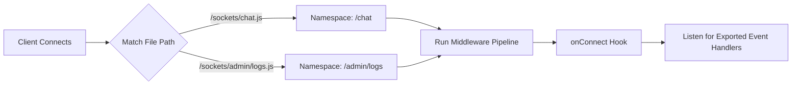

<div align="center">

# 🔌 SocketCraft

### Declarative, File-System Based WebSocket Framework for Node.js

[](https://www.npmjs.com/package/socket-craft)
[](#-license)
[](#)
[](#-contributing)

*Stop writing boilerplate. Start writing sockets folders.*

</div>

---

## 🧭 Table of Contents

| # | Section |
|---|---------|
| 1 | [Core Architectural Concepts](#1--core-architectural-concepts) |
| 2 | [Quick Start](#2--quick-start) |
| 3 | [API Reference](#3--api-reference) |
| 4 | [Lifecycle Hooks & Event Routing](#4--lifecycle-hooks--event-routing) |
| 5 | [Advanced Guide: Auth Middleware](#5--advanced-guide-building-an-auth-middleware) |
| 6 | [Rooms & Broadcasting](#6--rooms--broadcasting) |
| 7 | [Contributing](#7--contributing) |
| 8 | [License](#8--license) |

---

## 1. 🧩 Core Architectural Concepts

SocketCraft is built around **declarative file-system routing**. Instead of manually wiring namespaces and matching event strings by hand, your directory structure *is* your routing table.

<table>
<tr>
<td><b>❌ Traditional Approach</b></td>
<td><b>✅ SocketCraft Approach</b></td>
</tr>
<tr>
<td>

```javascript
io.of('/chat').on('connection', (socket) => {
  socket.on('message', (data) => {
    // handler logic
  });
});
```

</td>
<td>

```javascript
// sockets/chat.js
export function message(socket, data) {
  // handler logic
}
```

</td>
</tr>
</table>

### How Routing Works

```
project-root/
└── sockets/
    ├── chat.js        →  namespace: /chat
    ├── dashboard.js    →  namespace: /dashboard
    └── admin/
        └── logs.js     →  namespace: /admin/logs
```



Every function **exported** from a socket file automatically becomes an event listener scoped to that namespace — no manual registration required.

---

## 2. 🚀 Quick Start

```bash
npm install socket-craft
```

```javascript
import { SocketCraft } from 'socket-craft';

const app = new SocketCraft({ port: 4000 });

await app.listen();

console.log('🚀 SocketCraft server running on port 4000');
```

```javascript
// sockets/chat.js
export async function onConnect(socket) {
  socket.join('lobby');
}

export function message(socket, data) {
  socket.to('lobby').emit('message', data);
}
```

---

## 3. 📚 API Reference

### 3.1 `SocketCraft` Server Options

```javascript
import { SocketCraft } from 'socket-craft';

const server = new SocketCraft({
  socketsDir: './custom-sockets-folder',
  port: 5050,
  pingInterval: 15000,
  basePath: '/api/v1'
});
```

| Option | Type | Default | Description |
|---|---|---|---|
| `socketsDir` | `string` | `'./sockets'` | Directory scanned for namespace files |
| `port` | `number` | `4000` | Port the HTTP/WS server binds to |
| `pingInterval` | `number` | `30000` | Heartbeat interval (ms) for connection health checks |
| `basePath` | `string` | `''` | Optional URL prefix applied to all routed namespaces |

### 3.2 Server Instance Methods

| Method | Description |
|---|---|
| `.use(middlewareFn)` | Registers a global async middleware, executed before `onConnect` |
| `.listen(port?)` | Starts the HTTP and WebSocket server |
| `.close()` | Gracefully terminates all connections and closes open ports |
| `.to(room).emit(event, data)` | Broadcasts an event to a room across **all** namespaces |
| `.namespace(name).emit(event, data)` | Broadcasts an event to every client in a specific namespace |

### 3.3 `SocketCraftSocket` — Enhanced Client Instance

Every connected client is wrapped in an enhanced `SocketCraftSocket` object.

#### Properties

| Property | Type | Description |
|---|---|---|
| `socket.id` | `string` | Unique UUID generated per client session |
| `socket.namespace` | `string` | Active namespace/route (e.g. `/chat`) |
| `socket.query` | `object` | Parsed URL query parameters (e.g. `?token=123` → `socket.query.token`) |
| `socket.data` | `object` | Empty object reserved for developer-defined metadata |

#### Methods

| Method | Description |
|---|---|
| `socket.emit(event, data)` | Sends an event directly to this client |
| `socket.join(room)` | Adds the client to a room/channel |
| `socket.leave(room)` | Removes the client from a room |
| `socket.to(room).emit(event, data)` | Emits to everyone in a room **except** this client |
| `socket.broadcast.emit(event, data)` | Emits to the entire namespace **except** this client |
| `socket.disconnect(code, reason)` | Gracefully terminates the connection |

### 3.4 In-Memory Store — `app.store`

SocketCraft maintains real-time connection state inside a lightweight in-memory store.

| Method | Returns | Description |
|---|---|---|
| `app.store.clientCount()` | `number` | Total number of connected clients |
| `app.store.roomCount()` | `number` | Total number of active rooms |
| `app.store.getRooms()` | `string[]` | List of active room names |
| `app.store.getRoomMembers(roomName)` | `Set<string>` | Socket IDs currently inside the target room |

---

## 4. 🔁 Lifecycle Hooks & Event Routing

Any file inside `/sockets` may export the following reserved lifecycle hooks alongside custom event handlers.

```javascript
// sockets/dashboard.js

export async function onConnect(socket) {
  console.log(`User ${socket.id} connected to dashboard`);
}

export async function onDisconnect(socket) {
  console.log(`User ${socket.id} disconnected`);
}

export function onError(socket, error) {
  console.error(`Error in namespace: ${error.message}`);
}

export function fetchData(socket, data) {
  socket.emit('dataResponse', { status: 'healthy', tasks: 42 });
}
```

| Hook | Trigger |
|---|---|
| `onConnect(socket)` | Fired immediately after a successful handshake |
| `onDisconnect(socket)` | Fired when the connection is closed |
| `onError(socket, error)` | Fired when an unhandled error occurs within the namespace |
| `<eventName>(socket, data)` | Fired when the client emits `{ "event": "<eventName>", "data": {...} }` |

---

## 5. 🔐 Advanced Guide: Building an Auth Middleware

Middlewares run **sequentially** before `onConnect`. Throwing inside a middleware immediately rejects the connection with close code `1008` (Policy Violation).

```javascript
import { SocketCraft } from 'socket-craft';
import jwt from 'jsonwebtoken';

const app = new SocketCraft({ port: 8080 });

app.use(async (socket, request) => {
  const token = socket.query.token;

  if (!token) {
    throw new Error('Authentication token required');
  }

  try {
    socket.data.user = jwt.verify(token, process.env.JWT_SECRET);
  } catch (err) {
    throw new Error('Invalid or expired token');
  }
});

await app.listen();
```

> 💡 **Tip:** Anything attached to `socket.data` during middleware execution remains accessible in every downstream lifecycle hook and event handler for that connection.

---

## 6. 📡 Rooms & Broadcasting

| Scope | Syntax | Description |
|---|---|---|
| Single client | `socket.emit(event, data)` | Sends to the calling client only |
| Room, excluding sender | `socket.to(room).emit(event, data)` | Sends to a room, excludes sender |
| Namespace, excluding sender | `socket.broadcast.emit(event, data)` | Sends to the whole namespace, excludes sender |
| Global room | `app.to(room).emit(event, data)` | Sends to a room across all namespaces |
| Global namespace | `app.namespace(name).emit(event, data)` | Sends to every client in a namespace |

```javascript
export function joinRoom(socket, data) {
  socket.join(data.roomId);
  socket.to(data.roomId).emit('userJoined', { id: socket.id });
}
```

---

## 7. 🤝 Contributing

Contributions, issues, and feature requests are welcome!

1. Fork the repository
2. Create your feature branch — `git checkout -b feature/amazing-feature`
3. Commit your changes — `git commit -m 'Add amazing feature'`
4. Push to the branch — `git push origin feature/amazing-feature`
5. Open a Pull Request

---

## 8. 📄 License

Distributed under the **MIT License**. See `LICENSE` for more information.

---

<div align="center">

Made with ⚡ by the **SocketCraft** community

</div>
